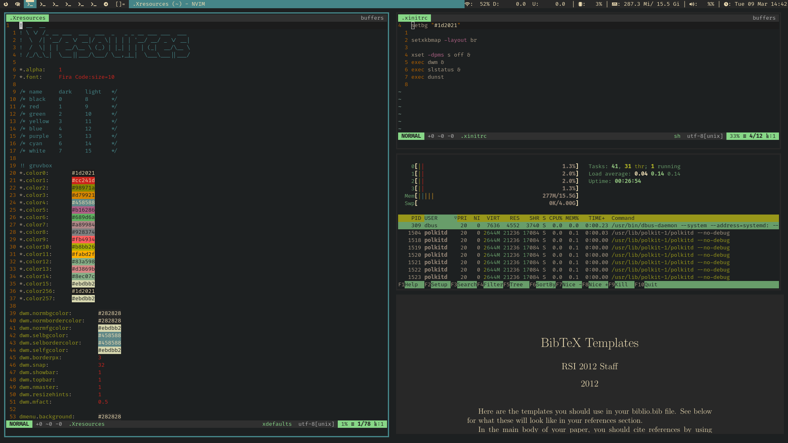
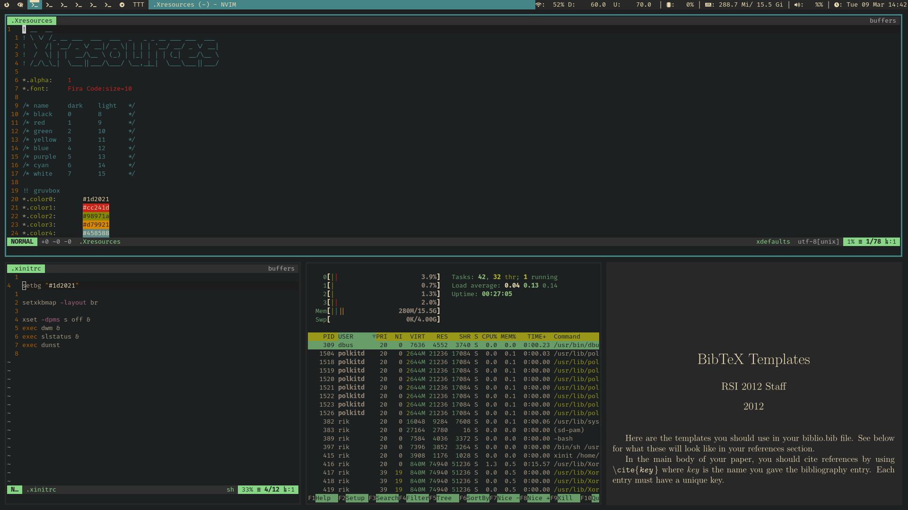
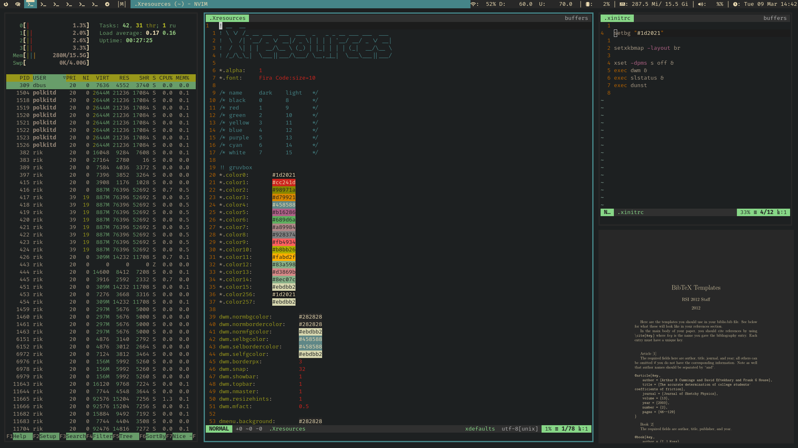
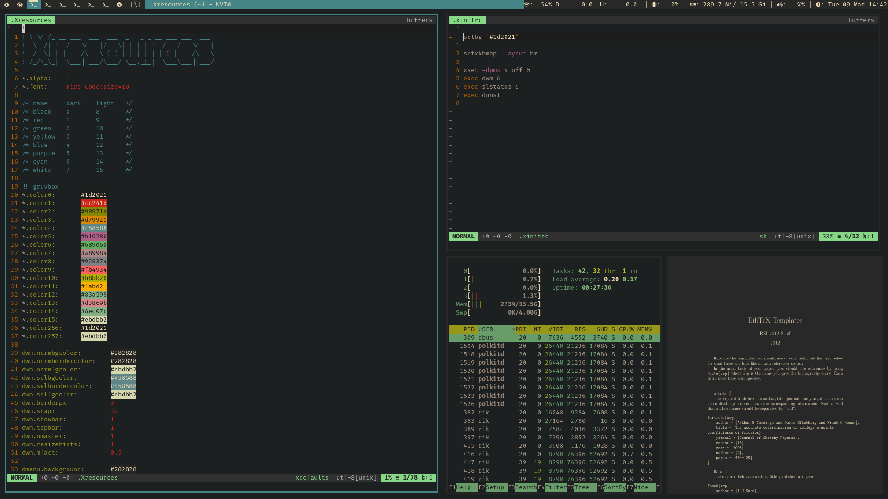

# Rik’s build of dwm


## Overview

Dwm is part of suckless tools for desktop. Its intention to be a simple
lightweight window manager, allowing heavy customization. Thereby, this
is my personal build of dwm, with the patches and settings that are most
useful to my workflow.

## Features

### Aesthetics

-   Bar tag indicator.
-   Actual fullscreen mode.
-   Inner and outer gaps.
-   Customizable via `.Xresources`.
-   No border when there is only one client in the tag.

### Funcionalities

-   Inverted client stack. Now the oldest client goes on top.
-   Mouse only focus on click.
-   The layouts are defined by each tag, but when there is only one
    client open, the layout is set to default.
-   Scratchpad for quick annotations (useful with R and Neovim).
-   Firefox spawn in tag 1, RStudio spawn in tag 2 and Telegram spawn in
    tag 9. Terminals can spawn in any tag.
-   sxiv and display (imagemagick) floats.

## Screenshots

### Tile layout



### Bottom stack layout



### Centered master layout



### Tree layout



## Hotkeys

-   `Super+d`: Spawn dmenu.
-   `Super+Return`: Spawn st.
-   `Super+{h,l}`: Change master/slaves proportion.
-   `Super+{j,k}`: Cycle through clients.
-   `Super+Shift+{j,k}`: Move client through the stack.
-   `Super+{1-9}`: Navigate through tags.
-   `Super+Shift+{1-9}`: Move client to specific tag.
-   `Super+Control+Shift+{1-9}`: Add client to specific tag.
-   `Super+Tab`: Go to next active tag.
-   `Super+Shift+Tab`: Go to previous active tag.
-   `Super+0`: Show all tags.
-   `Super+Shift+0`: Add client to all tags.
-   `Super+b`: Toggle bar
-   `Super+r`: Reset layout
-   `Super+Space`: Zoom client
-   `Super+f`: Toggle fullscreen
-   `Super+F5`: Tile layout.
-   `Super+F6`: Bottom stack layout.
-   `Super+F7`: Centered master layout.
-   `Super+F8`: Tree layout.
-   `Super+F9`: Mount drive.
-   `Super+Shift+F9`: Unmount drive.
-   `Super+F10`: System update.
-   `Super+F12`: Kill process.
-   `Super+Shift+F12`: Power off computer.
-   `Super+Print`: Take screenshot.
-   `Super+Shift+Print`: Record desktop.
-   `Super+n`: Toggle scratchpad.

## How to install

``` bash
git clone https://github.com/rikferreira/dwm.git
cd dwm
sudo make clean install
```

### Dependencies

These headers may appear in errors while trying to compile dwm:

``` c
#include <X11/Xlib.h>
#include <X11/Xft/Xft.h>
#include <X11/extensions/Xinerama.h>
```

The icons in the tag bar are from the `font-awesome` package.

#### Arch

``` bash
sudo pacman -S libx11 libxft libxinerama ttf-font-awesome
```

#### Debian

``` bash
sudo apt install libx11-dev libxft-dev libxinerama-dev fonts-font-awesome
```

Notice that are some bindings to scripts that aren’t in this repository.
You may want to remove those because they will look in your `$PATH` for
an executable with their names and it may not work as expected. I
reinforce that this is my personal build to this software and it is
designed to work with other elements of my desktop.
